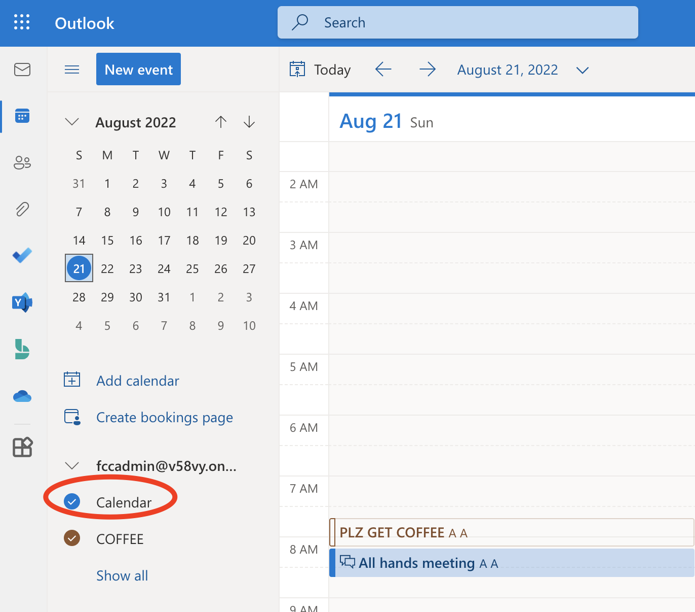

# Junction Asia 2022 - Mission 3 - Team Clippy - Table 67

By Andrei Calinescu and Sungwoo Lee

1. Sign in to the admin account (to be sent via a secure channel). All accounts in the sandbox have the same password so you can log in as other accounts in another browser to see how the workflow affects them.

1. Create an event in the `Calendar` folder. We will refer to it as `All Hands Meeting`.

   - Add yourself (the admin account you're using) as the first attendee, then add more attendees. We realize it's redundant to add ourselves as the first attendee abd wanted to change it but didn't have time because of other bugs.

   

1. The Power Automate workflow titled [`Schedule coffee order when meeting created`](https://make.powerautomate.com/environments/Default-10a7b0ee-5b7a-4ba9-a8b4-f0378b35ac8a/flows/shared/2b8cfe13-1df4-4784-a0d6-08215f227ad9) will detect this (but polling may take up to 5-7 minutes). That action will also perform the following functions:
   - Take the first attendee as the `coffeeGetter` - the person that has to buy the coffee. We wanted to change this to use the `organizer` field but didn't have time because of other bugs.
   - Create an event in the `COFFEE` calendar with the `coffeeGetter` as the only attendee. This is intended to ensure their schedule will remain free on the day of the meeting.
   - Assign `Americano` as the default drink choice for all attendants of the `All Hands Meeting`.
   - Send a private message to all `All Hands Meeting` attendees. This message will include buttons to select their drink order. If they choose a drink, this will overwrite the default choice. If attendees don't make a choice within 30 minutes, the workflow will terminate and their `Americano` choice will be locked in. We wanted to format this message more nicely but ran out of time.
1. 30 minutes before the `All Hands Meeting`, the `coffeeGetter` will receive a private Teams message from FlowBot with a summary of the order for every `All Hands Meeting` member. We also thought about this being added as the body of the `COFFEE` event but ran out of time.
1. They will buy the coffee and deliver it to the meeting on time.
